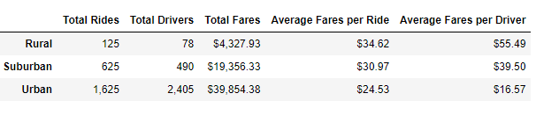
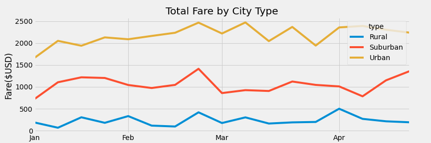

# PyBer_Analysis

## Table of Contents
- [Overview of Project](#OverviewProject)
  * [Background](#Background)
  * [Purpose](#purpose)
- [Results](#results)
    * [Ride-sharing summary by City Type](#citytype_summary)
    * [Total fares for each week by City Type](#fares_summary)
- [Summary](#Summary)
- [Resources](#resources)

## Overview of Project
### Background

**Pyber** is a python based ride-sharing app company valued at **$2.3 billion**. My job is to perform exploratory analysis on data in some very large CSV files. To aid this process we will create several types of Visualizations to tell a compelling story about the data. I will write Python scripts using Jupyter notebook and Matplotlib to create the variety of charts that showcase the relationship between the type of city and the number of drivers and riders as well as the percentage of the total fares,riders and drivers by type of city. **These visualization will help Pyber to improve access to ride sharing services and determine affordability for underserved neighborhoods.**

### Purpose

My task is to create a **Summary Dataframe** of the ride-sharing data by **types of city - Urban, Suburban and Rural**. Then, using **Pandas and Matplotlib**, we will **create a multiple-line graph** that shows the total weekly fares for each city type.

The entire data for this project is gathered in 2 files:
1. [city_data.csv](Resources/city_data.csv) - This file contains the information pertaining to the cities and has **3 columns: City, Driver Count, City Type.**
2. [ride_data.csv](Resources/ride_data.csv) - This file contains the information regarding the rides and fares in the cities. This file has **4 columns: City, Date and Time of ride, Fare, Ride Id.**  

 ## Results

### Ride-sharing summary by City Type
Below is the summary Dataframe of the ride-sharing data by **city type.** It includes the total rides, total drivers, total fares, average fare per ride and driver, and total fare by city type.

  

1. From the above sumary report we can see that **Pyber** is most popular in the **Urban Cities**. They have the highest number of rides **(=1,625)** compared to **Suburban and Rural cities**. **Suburban** cities have the **2nd** highest number of total rides.
2. The **Urban cities** have the **highest total number of drivers** as well. This is almost **5X** the number of drivers in the **Suburban cities** and **30X** the number of drivers in the **Rural cities**.  
3. The **total fares** generated by the **Urban cities** using Pyber app is the highest, **Rural** being the lowest. 
4. The **average fares per ride** is the highest in **Rural cities (=34.62 )** compared to Suburban and Urban cities. Thus, we can conclude that **a ride is most expensive in the rural cities and least expensive in the Urban cities.**
5. The **Average fares per Driver** is the highest for **rural cities (=$55.49)** and lowest for the Urban cities(=16.57). 

### Total fares for each week by City Type

The below multiple line chart shows Weekly total fares by City Types.

  

1. From the above chart we conclude that the **Urban cities** have the highest weekly total fares ranging from aproximately **$1600 to $2470.**
2. The **suburban cities** have the 2nd highest weekly total fares ranging from approximately **$700 to $1200.**
3. The **rural cities** have the lowest weekly total fares ranging from **$67 to $500.**  

## Summary

To summarize my report below are few of my recommendations to Pyber:

1. The total number of rides and the total number of drivers in the Rural cities is the lowest compared to the Urban and Suburban cities. My recommendation to Pyber would be to increase the number of drivers in the rural cities, so that the rides are readily available to more people. Hence this way Pyber would be able to generate more profit from Rural cities as well.
2. The average fares per ride is the highest in Rural cities (=34.62 ) compared to Suburban and Urban cities. Thus a ride is $10 more expensive compared to Urban cities. By increasing the number of drivers in Rural areas, the average fare per ride should reduce. 
3. My recommendation to Pyber is also to improve its marketing strategies in the Rural Areas, so that more people know about Pyber's ride sharing app. This way they will improve their profits from Rural areas.
4. When looking through the multiple Line chart containing the weekly total fares by city types, we see some spikes. There is a spike for all the city types in the week of 2th Feb 2019. My recommendation to Pyber would be to specially analyze the data during this week so as to understand the spike in the total fate. This would help Pyber to be well prepared for such occasiopns in future.

##  Resources
[1] [Code for Pyber Ride sharing Analysis](PyBer_Challenge.ipynb)  
[2] [City Data](Resources/city_data.csv)  
[3] [Rides Data](Resources/ride_data.csv)   

[4] Software: 
* Python 3.10.2
* Jupyter Notebook  

[5] Dependencies:
* Pandas Library
* Numpy Library
* Matplotlib Library
 
